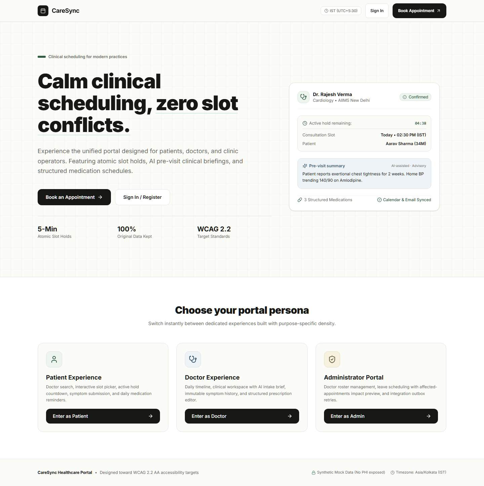
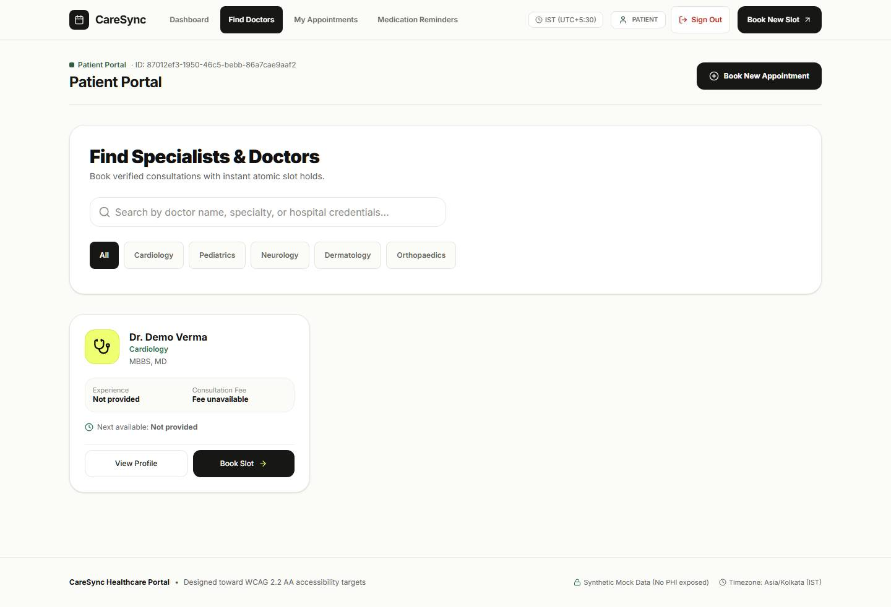
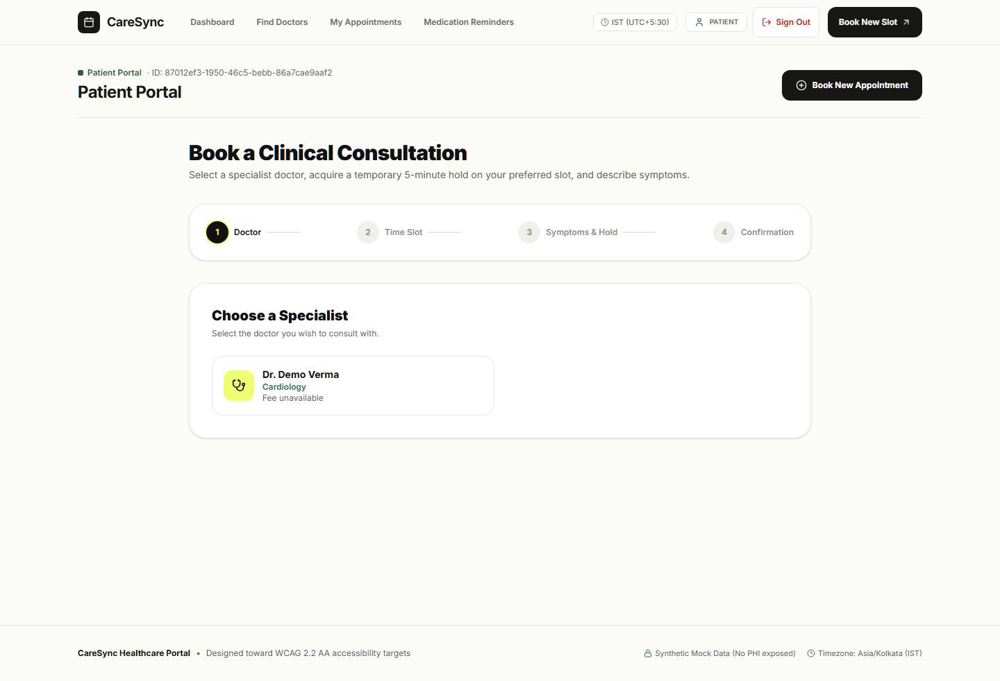
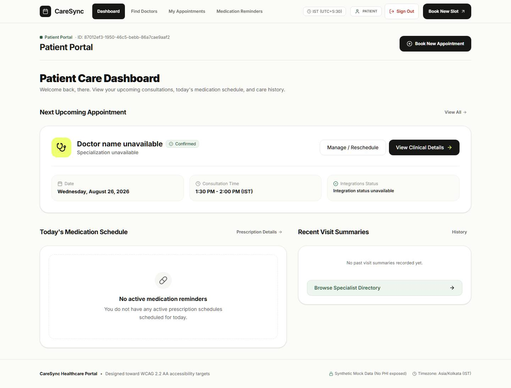
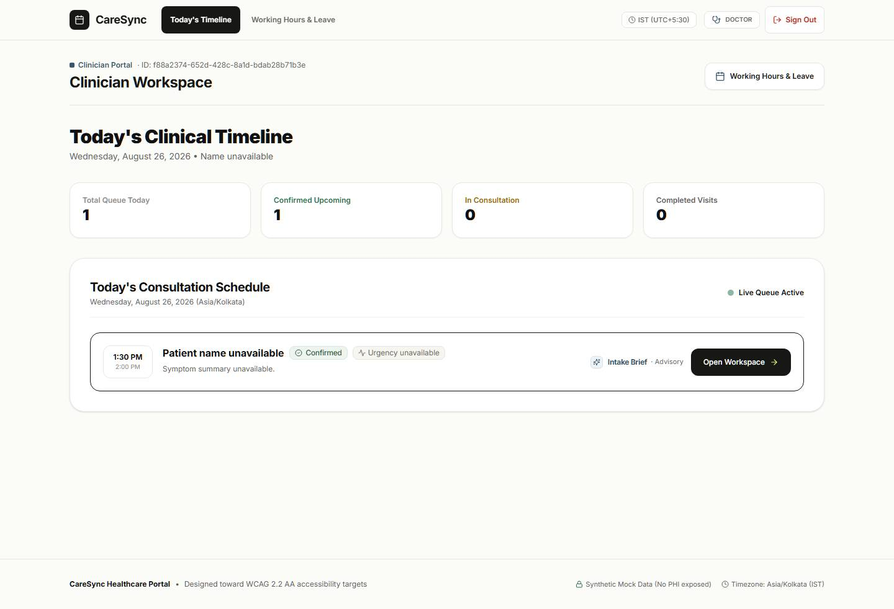
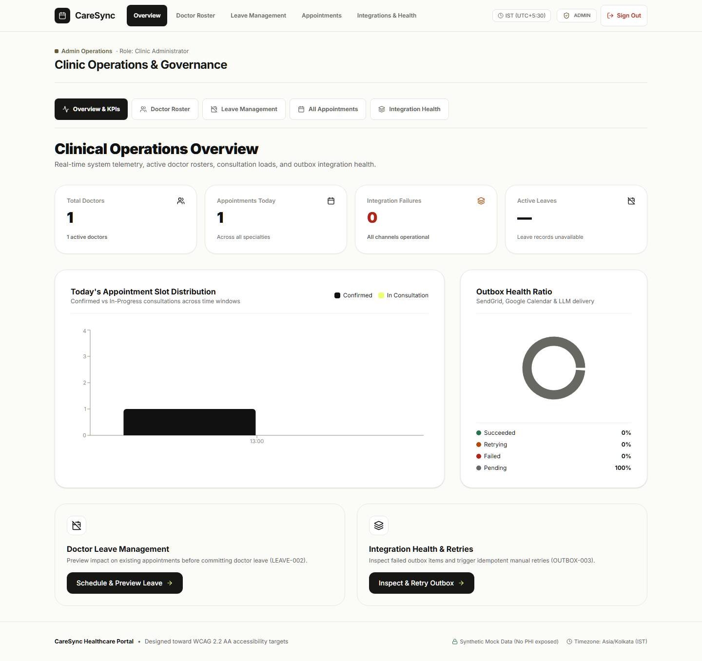

# CareSync

## Healthcare Appointment & Follow-up Manager

CareSync gives a clinic one dependable flow from symptom intake to follow-up. Patients find a specialist, hold a slot, describe symptoms, and receive appointment details. Doctors get a focused pre-visit brief and a structured visit workspace. Clinic administrators manage the roster, leave impact, appointments, and delivery health.

**[Open the live app](https://healthcare-appointment-manager-eight-pi.vercel.app/)** · **[API docs](https://healthcare-api-yipa.onrender.com/api/v1/docs)** · **[System design](docs/SYSTEM_DESIGN.md)**

> The demo uses synthetic records only. Do not enter real patient information.

## Product tour

Screenshots below were captured from the hosted app. They cover the public launcher, patient discovery and booking, the clinician timeline, and clinic operations.

<p align="center">
  
  
  
  
  
  
</p>

## What works

| Portal | Main workflows |
| --- | --- |
| Patient | Search by specialty, view availability, acquire a five-minute slot hold, submit symptoms, confirm or reschedule, review visits and medication schedules. |
| Doctor | See the daily queue, review the original symptom text beside the advisory AI brief, draft notes, build structured prescriptions, and complete or amend a visit. |
| Admin | Provision doctors, configure hours and leave, preview affected appointments before applying leave, inspect appointments, and retry integration outbox items. |
| Reliability | PostgreSQL-backed booking constraints, idempotency keys, optimistic versions, durable outbox events, retry state, and graceful provider failure. |

## Architecture

```text
apps/web       Next.js 15 frontend with typed HTTP boundary and Supabase Auth
apps/api       FastAPI service, SQLAlchemy models, Alembic migrations, RBAC
apps/worker    PostgreSQL outbox poller, provider adapters, retry and lease logic
supabase/      Hosted Auth and database migration files
docs/          Contracts, schema, prompts, deployment notes, and system design
```

The API owns authorization and booking truth. Slot availability is advisory; the database transaction owns the final conflict decision. AI output is stored as advisory generated artifacts, while original patient and clinician text remains authoritative.

## Hosted demo

- **Web:** Vercel production deployment at [healthcare-appointment-manager-eight-pi.vercel.app](https://healthcare-appointment-manager-eight-pi.vercel.app/).
- **API:** Render service at [healthcare-api-yipa.onrender.com](https://healthcare-api-yipa.onrender.com/api/v1/health/live).
- **Data and Auth:** Supabase PostgreSQL 17 and Supabase Auth.

The free-tier demo keeps email, Google Calendar, and LLM adapters in safe degraded mode until provider credentials and a continuously running worker are enabled. Core authentication, doctor discovery, booking, and API health checks are live.

## Run locally

Requirements: Node.js 24+, pnpm 11.23.0, Python 3.13+, uv, and Docker Desktop.

```powershell
corepack pnpm install --frozen-lockfile
docker compose up -d postgres redis
Push-Location apps/api
uv sync --locked --extra dev
uv run alembic upgrade head
Pop-Location
corepack pnpm --filter @healthcare-manager/web dev
```

Run the API and worker in separate terminals:

```powershell
Push-Location apps/api
uv run uvicorn healthcare_api.main:app --reload --host 0.0.0.0 --port 8000
Pop-Location

Push-Location apps/worker
uv sync --locked
uv run python -m healthcare_worker --poller
Pop-Location
```

Copy `.env.example` to `.env` for local values. Never commit a real key, token, provider payload, or patient record.

## Validation

```text
corepack pnpm lint
corepack pnpm typecheck
corepack pnpm test
corepack pnpm build
```

The API and worker suites use isolated PostgreSQL 17 coverage plus Ruff, format, mypy, and compile checks. See [docs/ACCEPTANCE_TESTS.md](docs/ACCEPTANCE_TESTS.md) for the full gate.

## Documentation

- [API guide and route inventory](docs/API_GUIDE.md)
- [Executable API contract](docs/API_CONTRACT.md)
- [Database schema](docs/DATABASE_SCHEMA.md)
- [LLM prompts and failure behavior](docs/LLM_PROMPTS.md)
- [Email and Google Calendar integrations](docs/INTEGRATIONS.md)
- [Deployment runbook](docs/DEPLOYMENT.md)
- [Submission system design](docs/SYSTEM_DESIGN.md)

## Security boundary

CareSync is an engineering submission and demo. It is not a claim of HIPAA or other regulatory compliance. Complete privacy, consent, retention, backup, incident-response, and provider-security review before accepting real healthcare data.
