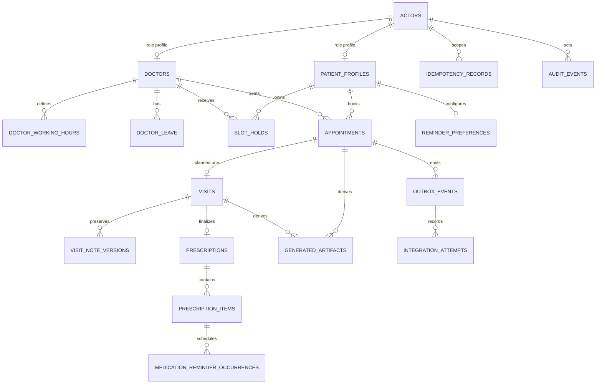

# Database schema and ownership

The only applied migration in this snapshot is
[`apps/api/alembic/versions/0001_booking_foundation.py`](../apps/api/alembic/versions/0001_booking_foundation.py).
It targets PostgreSQL 17, enables `pgcrypto` and `btree_gist`, and is the source of
truth for the **current** tables below. Clinical, generated-artifact, and reminder
tables are contract-required design targets but are not present in this migration; the
concurrent API completion lanes must add reviewed migrations before those endpoints are
enabled.

## Relationship diagram

The solid portion is implemented. Dashed entities are planned and must not be inferred
from the current database.

## Implemented tables

| Table | Ownership and important fields | Constraints/indices |
| --- | --- | --- |
| `actors` | One row per application subject: UUID `id`, immutable external `subject_id`, `role` (`patient`, `doctor`, `admin`), `is_active`, timestamps. | Unique subject; role check; profile FKs use `ON DELETE RESTRICT`. In Phase 1 the bearer value is looked up as `subject_id`; Supabase JWT validation is deferred. |
| `patient_profiles` | One-to-one role profile keyed by `actor_id`; synthetic/display name only in the foundation. | Primary key and actor FK; patient holds/appointments reference this key with `RESTRICT`. |
| `doctors` | Public/operational doctor profile: actor link, display name, credentials, specialization, IANA `timezone`, allowed `appointment_durations_minutes[]`, active flag, `schedule_version`. | One doctor profile per actor; schedule version must be positive. |
| `doctor_working_hours` | Recurring local wall-clock interval by doctor and `weekday` (0–6), `starts_local`, `ends_local`. | `starts_local < ends_local`; unique interval per doctor/day; index by doctor/day. |
| `doctor_leave` | Concrete UTC `starts_at`/`ends_at`, optional reason, active flag. | `starts_at < ends_at`; indexed by doctor/interval. Leave overlap blocks availability; the atomic preview/apply workflow is contract-only today. |
| `slot_holds` | Patient-owned provisional interval, doctor, generated `expires_at`, lifecycle status (`active`, `released`, `expired`, `converted`), integer version, and generated half-open `tstzrange`. | `starts_at < ends_at`; PostgreSQL GiST exclusion on same doctor plus overlapping range while `status = 'active'`; patient/doctor status/expiry indices. The server/database clock owns expiry. |
| `appointments` | Patient, doctor, half-open interval, status (`confirmed`, `in_progress`, `completed`, or a `cancelled_*` value), immutable original `symptoms_text`, integer version, generated range. | GiST exclusion prevents overlap for a doctor while status is `confirmed` or `in_progress`; cancelled rows no longer block. Patient/doctor/status date indices. |
| `idempotency_records` | Actor-scoped method/route/key, request fingerprint, completed status/body, timestamps. | Unique `(actor_id, method, route_template, idempotency_key)`; enables replay without repeating hold/confirm side effects. Retention policy is not yet configured. |
| `outbox_events` | Event type, aggregate identity, optional appointment FK, stable `dedupe_key`, JSON routing payload, status (`pending`, `processing`, `succeeded`, `retrying`, `failed`), attempts, next-attempt time, safe error code, processed time. | Unique event/aggregate/dedupe tuple; claimable status/time and appointment indices. Appointment FK is `ON DELETE CASCADE`; the worker must not make this broker state authoritative. |
| `audit_events` | Optional actor, action, resource type/UUID, request correlation ID, outcome, bounded structured reason, timestamp. | Actor deletion sets NULL. An immutable trigger rejects update/delete; resource and actor/time indices support audit queries. Do not copy full clinical text. |

All intervals are half-open `[starts_at, ends_at)`. Instants are stored with timezone
and normalized to UTC. Doctor schedules remain in the doctor's IANA zone until the
server resolves concrete instants. Foreign keys and role/interval/status checks protect
ownership, but API authorization is still required for every read and mutation.

## Planned clinical and reminder tables

These entities are required by the frozen domain/API contracts but need a later
migration and implementation review:

- **`visits`** — one visit per appointment, assigned doctor, draft/completed status,
  current version, and completion metadata. Only a confirmed/in-progress appointment
  can open a visit; completed visits are immutable.
- **`visit_note_versions`** — append-only doctor-authored source notes with author,
  version, timestamp, and reason. New summaries never overwrite an original note.
- **`prescriptions` / `prescription_items`** — visit-linked prescription and stable
  item UUIDs containing medication display name, dosage, route, structured frequency,
  start/end or duration, instructions, and prescriber. Doctor review, not LLM prose,
  is the write authority.
- **`generated_artifacts`** — source record/version, task kind, prompt/schema version,
  provider/model, status (`pending`, `ready`, `unavailable`, `failed`),
  generated content or safe reference, attempt/error metadata, correlation ID, and
  timestamps. The artifact must be visibly generated and separately permissioned.
- **`reminder_preferences`** — patient channel/consent, local time zone, enabled
  state, and optimistic version.
- **`medication_reminder_occurrences`** — deterministic occurrences derived from a
  prescription-item version, occurrence time in UTC plus patient zone, delivery
  status/attempts, and stable idempotency key. A prescription revision cancels future
  occurrences from the superseded version before scheduling replacements.
- **`integration_attempts`** (or an equivalent outbox-attempt history) — normalized
  email/calendar/LLM/reminder outcomes and provider references without access tokens or
  clinical payloads. The exact table split is deferred; current `outbox_events`
  already has durable status/attempt columns.

## Write and failure rules

1. Booking reads availability only as a hint. The hold/appointment transaction locks the
   doctor's booking lane and relies on PostgreSQL range exclusion under concurrency.
2. Hold confirmation inserts the appointment, converts the hold, writes required outbox
   rows, and appends an audit event in one transaction. Any failure rolls back all of
   those changes.
3. Leave application must use a short-lived impact preview and schedule version. It
   invalidates overlapping active holds, changes every overlapping confirmed appointment
   to `cancelled_doctor_leave`, and emits notification/calendar work atomically.
4. External provider failure changes only integration/derived-output state. It never
   deletes or invalidates a committed appointment, visit, or prescription.
5. Queue payloads contain opaque IDs and routing metadata. The Phase 1 worker envelope
   rejects common clinical/identity keys; source text is fetched behind a later secure
   adapter boundary.
6. Patient/doctor ownership is enforced at query time, not by a client-provided role,
   profile ID, or guessed UUID. Administrative operational views exclude clinical text
   by default.
7. Audit rows are append-only. Backups, retention, deletion/export, and encryption-key
   policy must be finalized before production data is accepted.
