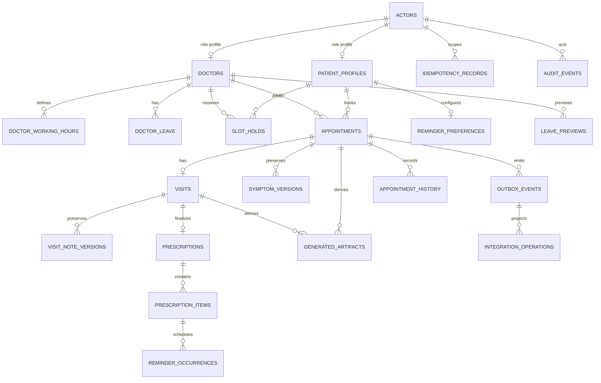

# Database schema and ownership

PostgreSQL 17 is the system of record. Alembic applies a linear schema through
[`0002_application_domain.py`](../apps/api/alembic/versions/0002_application_domain.py)
after [`0001_booking_foundation.py`](../apps/api/alembic/versions/0001_booking_foundation.py).
`0002_application_domain` is executable in the current source; the clinical, generated,
reminder, integration, history, and leave-preview tables below are not planned-only
placeholders. Run `cd apps/api; uv run alembic upgrade head` before starting API or
worker processes.

## Relationship diagram

## Foundation tables (`0001_booking_foundation`)

| Table | Ownership and important fields | Constraints/indices |
| --- | --- | --- |
| `actors` | Supabase subject mapping: UUID `id`, unique `subject_id`, role (`patient`, `doctor`, `admin`), active flag, timestamps. | Role check; profile FKs use `ON DELETE RESTRICT`. |
| `patient_profiles` | Patient display profile keyed by `actor_id`; `0002` adds IANA `timezone` and positive `version`. | Primary-key actor FK; holds/appointments reference the actor key. |
| `doctors` | Actor link, display name, credentials, specialization, IANA `timezone`, allowed appointment durations, active flag, schedule `version`. | One doctor per actor; positive version; doctor/day working-hours index. |
| `doctor_working_hours` | Recurring local interval by doctor and weekday (`0..6`). | `starts_local < ends_local`; unique doctor/day/interval. |
| `doctor_leave` | Concrete UTC interval, reason, active flag, positive version. | Ordered interval; doctor/time index. Active leave blocks availability. |
| `slot_holds` | Patient-owned provisional interval, generated expiry, lifecycle status, version, and generated half-open `tstzrange`. | GiST exclusion prevents same-doctor overlap while active; expiry/status indices. |
| `appointments` | Patient/doctor interval, status, immutable source `symptoms_text`, optional urgency, version, generated range. | GiST exclusion prevents overlap for `confirmed`/`in_progress`; cancelled rows no longer block. |
| `idempotency_records` | Actor/method/route/key, request fingerprint, first status/body, timestamps. | Unique actor/method/route/key supports safe replay. |
| `outbox_events` | Event type/aggregate, optional appointment, dedupe key, opaque JSON payload, status, attempts, next attempt, normalized error, `version`, and `correlation_id`. | Unique event/aggregate/dedupe; claimable status/time index and appointment FK. |
| `audit_events` | Actor, action, resource, request correlation, outcome, bounded reason, timestamp. | Immutable trigger rejects update/delete; resource and actor/time indices. |

All appointment/hold intervals are half-open `[starts_at, ends_at)`, stored as timezone
aware values and normalized to UTC. PostgreSQL time and range constraints remain the
booking authority; API authorization is still required for every read and mutation.

## Application-domain tables (`0002_application_domain`)

| Table | Executable role and source-preservation rule | Key constraints/state |
| --- | --- | --- |
| `symptom_versions` | Append-only patient/imported symptom source versions linked to an appointment. | Unique appointment/version; source is `patient` or `imported`; text is required. |
| `visits` | One doctor-owned visit per appointment with draft/completed state, urgency, version, and completion time. | Unique appointment; appointment/doctor FKs; status and positive-version checks. |
| `visit_note_versions` | Append-only doctor note source versions with optional author actor. | Unique visit/version; notes are required and never overwritten by generated text. |
| `prescriptions` | One draft/completed prescription per visit with optional advisory text. | Unique visit; status and positive-version checks. |
| `prescription_items` | Structured medication, dosage, route, frequency, dates/duration, instructions, prescriber. | Enumerated frequency; bounded duration; ordered dates; reminders use these fields only. |
| `generated_artifacts` | Versioned pre-visit brief/post-visit summary tied to an appointment or visit, with source record/version metadata, task/provider/model, content, and error code. | Status is `pending`/`succeeded`/`failed`; owner check requires appointment or visit. |
| `reminder_preferences` | Patient channel, enabled flag, IANA timezone, local times, and version. | One row per patient; channel is `email`/`sms`/`push`. |
| `reminder_occurrences` | Deterministic prescription-item/version occurrence, due time, dedupe key, sent time, and status. | Unique `dedupe_key`; status is `pending`/`sent`/`cancelled`/`failed`; due index. |
| `integration_operations` | Per-outbox channel state, attempt count, provider reference, safe error, and version. | Unique outbox-event/channel; state is `pending`/`succeeded`/`retrying`/`failed`; channel/state index. |
| `appointment_history` | Append-only status/interval transitions, actor, reason, and timestamp. | Appointment FK and appointment/time index. |
| `leave_previews` | Hashed short-lived impact token, doctor interval, expected schedule version, affected hold/appointment IDs, creator, expiry, and use time. | Unique token hash; ordered interval and positive expected version; doctor/expiry index. |

## Transaction and failure rules

1. Availability is advisory. Hold creation and confirmation revalidate schedule, leave,
   expiry, and overlap inside a PostgreSQL transaction.
2. Confirmation writes the appointment, converts the hold, creates required outbox rows,
   and appends audit state atomically. A failure leaves none of those changes committed.
3. Leave application uses a preview token and schedule version, invalidates overlapping
   holds, cancels every affected confirmed appointment, and writes notification/calendar
   intents in the same transaction.
4. The worker claims durable rows with leases and fencing. Provider failure changes only
   integration/derived-output status; it never deletes or invalidates a domain record.
5. Queue payloads carry opaque references and routing metadata. Clinical source text is
   preserved in the database and is resolved only behind the trusted worker boundary.
6. Patient/doctor ownership is enforced at query time, not by client role or guessed UUID.
   Administrative operational views exclude clinical text by default.
7. Audit rows are append-only. Retention, deletion/export, backups, encryption-key
   rotation, and recovery policy must be reviewed before production data is accepted.
